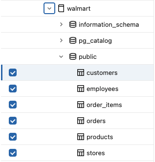
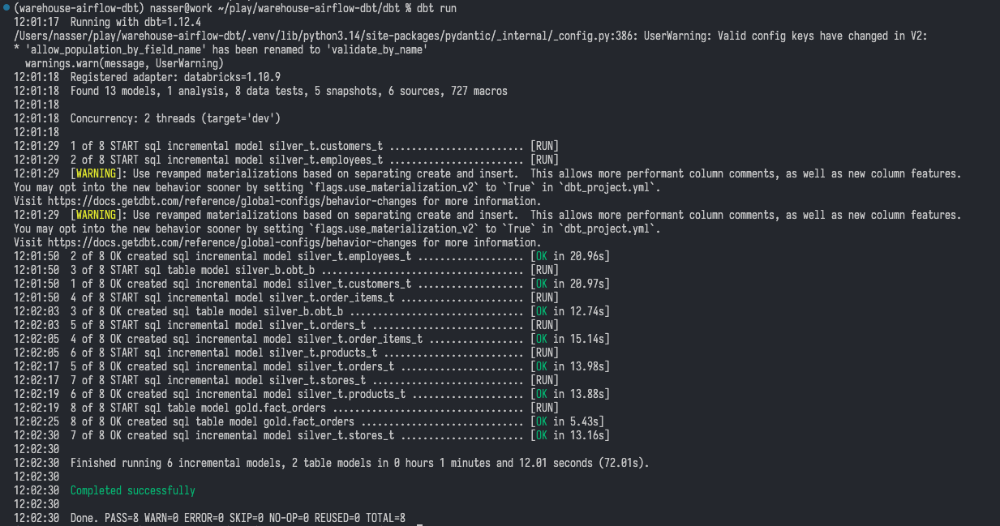

# warehouse-airflow-dbt
This project demonstrates how to build a comprehensive data warehousing solution using Databricks with Apache Airflow for pipeline orchestration and DBT for data trasnformation.


Terchnology Stack
Neon: A serverless postgress semantic data layer for AI agents
Create an account and project in the region closest to you and enable postgres DB + Neon Auth
Should typically offers vertical Autoscaling up to 2 CU, 0.5 GB storage and 10 branches per project

Set up this Neon project in the current working directory.

1. `npm i -g neon@latest && neon login`
2. `neon skills -y`
3. `neon mcp -y`
4. `neon link --project-id muddy-rain-82310653 --branch production -y`
5. `neon config init`
6. Update `neon.ts`:

```ts
import { defineConfig } from "@neon/config/v1";

export default defineConfig({
  auth: true,
});
```

1. `neon deploy`


Databricks:
Create a standard catalog with called 'walmart' and grant access to all workspaces. on

On the metadata screen, save without creating any keys

create schema


import data into the bronze schema using CDC ingestion pattern for incremental loading with upserts. This will eliminate the need for indepotency and only-once.

ensure that the db is up and running

```bash
neon psql --database-name <your_database_name>
```

Once that's confirmed, go to databricks data ingestion and select postgress connection. Select the Username and Password option and fill the details of the connections
The postgres db credentials are in the db connection string that was generated at project creation:
postgresql://`username`:`password`@`host`/neondb?channel_binding=require&sslmode=require
The host will typically be `ep-dawn-river-b2ixnkll-pooler.c-6.eu-central-1.aws.neon.tech`

Once the connection is created, select it and click 'Next'

Change data capture -- not available in free mode of Databricks
Captures inserts, updates, and deletes using native CDC on the source database.

Query based capture
Runs a managed query to pull data incrementally or in batch mode from the source.


Once the generation step is complete, You will be prompted to add your database name, to tell databricks which data to ingest.

Cursor column is the column that will be used for inference to tell what data is new. I set it to the `update_timestamp` column

Select the `bronze` schema as the destination, add the scheduled runs and setup receipients of failure alerts

Save and run pipeline

Add dbt to the project `uv add dbt-core`
Add databricks engine for dbt to the project `uv add dbt-databricks`

initialise the dbt project `dbt init` you can run this in the project root but in myy case i had to change directory to the dbt folder before running the initialisation
set project name to a name of your choice and select the dataanse as databricks.
For the next step, dpt will request for the host, http_path and access token. To get these:
1. host and http_path:
navigate to the SQL Warehouse menu and go to the Connection details tab and copy the Server host name -> host and HTTP path -> http_path
2. Access token:
  - Navigate to your profile settings and go to the Developer options
  - Generate a token and set the scope to sql (and other elevant apis)
    - !Remember to save the token somewhere before closing the dialogue
3. Allow the use unity catalog and set the catalog name to the one used in databricks
4. Set schema to a name of choice and threads to 1[enough for this project]
In case of database connection failure, `cat ~/.dbt/profiles.yml` and update any wrong configurations and savet.
Run `dbt debug` to confirm that the changes are working

install 
Important that you follow the extension's instructions to make sure that the dependencies are fully resolved.
-- move the projects

```bash
mv ~/.dbt/profiles.yml ~/repository_path/dbt/profiles.yml
mv dbt/warehouse/your _dbt_project_name.yml dbt/your_dbt_project_name.yml
```
add sources
create models for the silver_technical(`silver_t`) layer
`dbt run` to create dbt model tables in databricks

Create dbt generic tests for the models before accepting any data to the new tables.
run `dbt test` to


