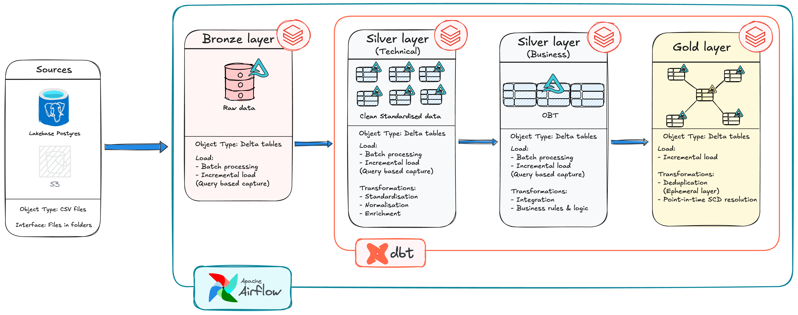
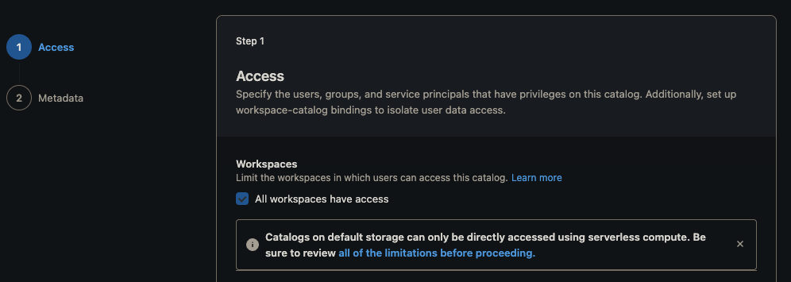
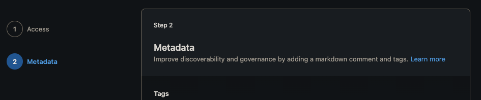
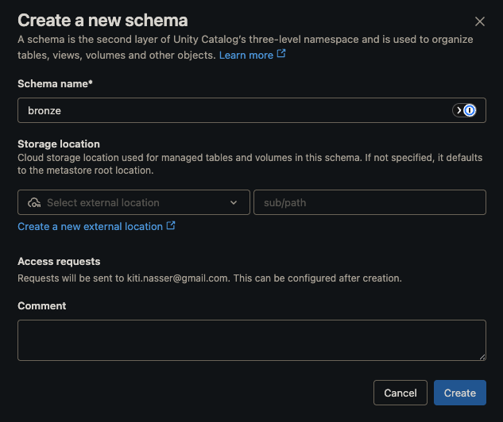
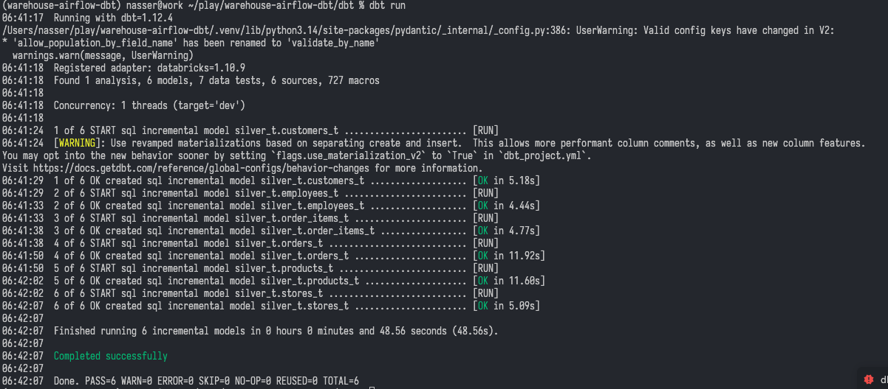
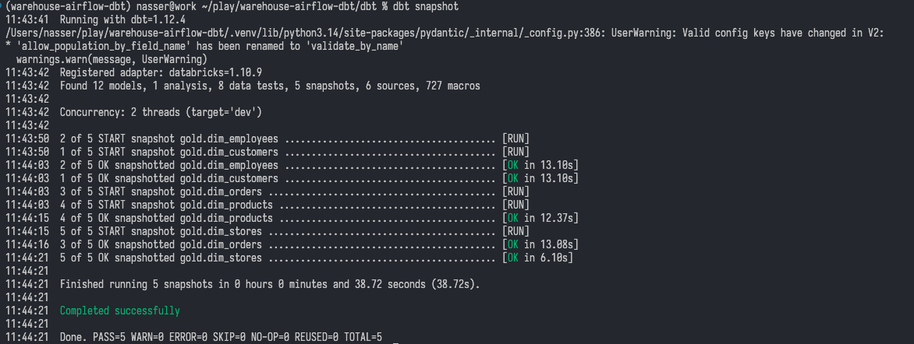
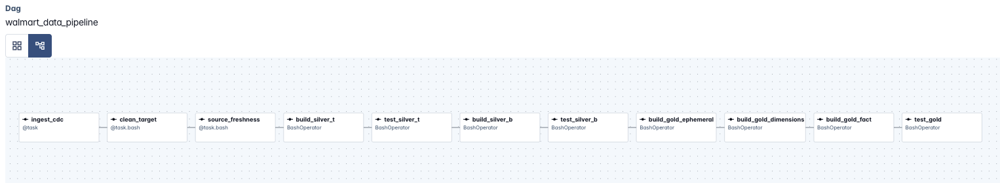

## Data Warehousing Project (Databricks + dbt + Airflow)

This project demonstrates how to build a modern data warehouse on **Databricks (Unity Catalog)**, using **dbt** for transformation and **Apache Airflow** (via Docker Compose) for orchestration. It ingests a synthetic Walmart-style retail dataset from a serverless Postgres source into a lakehouse, with **SCD Type 2** history on Gold dimensions.

### Table of Contents

- [Project Overview](#project-overview)
- [Project Requirements](#project-requirements)
- [Objective](#objective)
- [Data Architecture](#data-architecture)
- [Getting Started](#getting-started)
- [Data Loading Pipeline](#data-loading-pipeline)
- [Orchestration](#orchestration)
- [Data Sources](#data-sources)
- [Data Quality Checks](#data-quality-checks)
- [Troubleshooting](#troubleshooting)
---

### Project Overview

This project involves:

- **Data Architecture**: A Medallion architecture on Databricks Unity Catalog.
- **Ingestion**: Incremental, timestamp-based capture from a Postgres OLTP source into Databricks via a managed Lakeflow connection.
- **Transformation**: dbt models on Databricks SQL; incremental silver models, a denormalised One Big Table (OBT) business layer, and a Gold-layer star schema with SCD Type 2 dimensions.
- **Data Quality**: dbt generic and custom tests, gating each layer before the next is allowed to build.
- **Orchestration**: An end-to-end Airflow DAG (run via Docker Compose) that sequences ingestion and building the layers gated with tests.

### Project Requirements

### Objective

Build a Databricks-based data warehouse that ingests retail transaction data from an OLTP source, models it into a dimensional (star schema) Gold layer with historized dimensions, and orchestrates the full pipeline with Airflow using incremental loading.

#### Business Rules

- Each source table carries `created_timestamp`, `updated_timestamp`, and `is_active` audit columns; `updated_timestamp` is the cursor column for incremental capture and for SCD Type 2 change detection in Gold.
- Records are upserted (not appended) on their natural key so re-running ingestion or dbt does not create duplicates. Natural keys are used throughout even in the Gold dimensions since dbt's snapshot feature already generates its own surrogate versioning columns (`dbt_scd_id`, `dbt_valid_from`, `dbt_valid_to`), so hand-rolled surrogate keys aren't needed.
- The silver_b OBT must never contain a row with a null foreign key across the six join keys (`order_id`, `order_item_id`, `customer_id`, `product_id`, `employee_id`, `store_id`). This is enforced with `error` severity for all tests so a broken join halts the pipeline before Gold builds on bad data.
- Gold dimensions (`dim_customers`, `dim_products`, `dim_stores`, `dim_employees`, `dim_orders`) are historized with **SCD Type 2** to support point-in-time correctness e.g. an order should be attributable to the customer's address *as it was when the order was placed*, not their current address.
- **Known scope limitation**: `dim_orders` tracks changes to order-level attributes (status, payment method) as of each pipeline run, not as a full event log. The source system only captures a single `updated_timestamp` per order. It does not log the timestamp of each individual status transition. This means duration-between-status-changes (e.g., "how long did this order take to ship") is not reliably derivable from this design; capturing that would require an event/audit log at the source.

#### Specifications

- **Data Source**: A single OLTP-style source (Postgres, hosted on Neon) with six related tables: `customers`, `stores`, `products`, `employees`, `orders`, `order_items`.
- **Loading Strategy**: Incremental only since native CDC is unavailable on Databricks' free tier, so ingestion uses query-based incremental capture on `updated_timestamp` instead.
- **Integration**: All six tables are joined into a single wide business table (OBT), deduplicated into per-entity ephemeral models, historized into Type 2 dimensions, and reassembled into a fact table at the order-item grain.
- **Documentation**: Clear source-to-target mapping and setup steps so the pipeline can be reproduced from scratch (see [Getting Started](#getting-started)).

---

### Data Architecture

The project follows a Medallion architecture pattern with Bronze, Silver and Gold layers on Databricks Unity Catalog:

- **Bronze Layer**: Raw data landed from the Postgres source into the `walmart.bronze` schema via Databricks Lakeflow, no transformation applied.
- **Silver_t (Technical) Layer**: One incremental dbt model per source table (`customers_t`, `stores_t`, `products_t`, `employees_t`, `orders_t`, `order_items_t`), each keyed on its natural ID and watermarked on `updated_timestamp`, with a `processed_at` audit column added.
- **Silver_b (Business) Layer**: A single denormalised One Big Table (`obt_b`) that left-joins all six Silver_t models around `orders`, renaming columns per source table (e.g. `customer_first_name`, `store_city`).
- **Gold Layer**:
  - **Ephemeral models** (`eph_customers`, `eph_products`, `eph_stores`, `eph_employees`, `eph_orders`): deduplicated, per-entity views over `obt_b`, materialised as `ephemeral` (compiled inline, no physical table).
  - **Dimensions** (`dim_customers`, `dim_products`, `dim_stores`, `dim_employees`, `dim_orders`): dbt **snapshots** over the ephemeral models, using `strategy: timestamp` on each entity's `updated_timestamp` column, giving full SCD Type 2 history (`dbt_valid_from`, `dbt_valid_to`, `dbt_scd_id`).
  - **Fact** (`fact_orders`): built directly from `obt_b` at the **order-item grain** (one row per `order_item_id`), carrying natural keys and measures (`total_amount`, `quantity`, `unit_price`, `line_amount`).



#### Technology Stack

- **Source Database**: Postgres (serverless, via [Neon](https://neon.tech))
- **Lakehouse Platform**: Databricks (Unity Catalog, Lakeflow ingestion, SQL Warehouse)
- **Transformation**: dbt Core with the `dbt-databricks` adapter
- **Orchestration**: Apache Airflow 3.x (CeleryExecutor, via Docker Compose), triggering Databricks jobs via the `databricks-sdk`
- **Package/Environment Management**: `uv` (Python), Node/npm (for Neon CLI tooling)
- **IDE**: VS Code, with the "Power User for dbt" extension

---

### Getting Started

#### Prerequisites

- A [Neon](https://neon.tech) account (serverless Postgres)
- A Databricks workspace with Unity Catalog enabled
- Python 3 with `uv` installed
- Node.js (for the Neon CLI)
- Docker and Docker Compose (for Airflow)

#### Setup Steps

1. **Provision the Postgres source (Neon)**

   ```bash
   npm i -g neon@latest && neon login
   neon skills -y
   neon mcp -y
   neon link --project-id <your-project-id> --branch production -y
   neon config init
   neon deploy
   ```

2. **Create the source schema and seed data**

   ```bash
   psql "$DATABASE_URL" -f src/warehouse_airflow_dbt/init_database.sql
   uv run src/warehouse_airflow_dbt/load_data.py --data-dir assets/data
   ```

3. **Create the Unity Catalog structure in Databricks**

   Create a standard catalog named `walmart`, grant access to all workspaces, then create the `bronze` schema inside it.




4. **Connect Databricks to the Postgres source**

   Confirm the database is reachable, then in Databricks go to **Data Ingestion**, then **Postgres connection** and authenticate using the connection string generated at project creation:

   ```bash
   neon psql --database-name <your_database_name>
   ```

   > Hint: The connection details are in the database url
   > `postgresql://<username>:<password>@<host>/<database>?channel_binding=require&sslmode=require`

   Native Change Data Capture is **not available on Databricks' free tier**, so this pipeline uses **query-based incremental capture** instead, using `updated_timestamp` as the cursor column, landing into the `bronze` schema on a schedule with failure alerts.

5. **Set up dbt**

   ```bash
   uv add dbt-core dbt-databricks
   cd airflow/dbt && dbt init
   ```

   Provide the **host** and **HTTP path** from your Databricks SQL Warehouse's *Connection details* tab, an **access token** (Databricks profile → *Developer options*, scope: `sql`), **catalog**: `walmart`, and **threads**: `1`.

   If `dbt debug` fails, check `~/.dbt/profiles.yml` (or `airflow/dbt/profiles.yml`, since this project keeps its profile alongside the dbt project) for misconfigured values.

6. **Run and test the models manually (optional - see [Orchestration](#orchestration) for the automated path)**

   ```bash
   dbt run --select silver_t && dbt test --select silver_t
   dbt run --select silver_b && dbt test --select silver_b
   dbt run --select gold/ephemeral
   dbt snapshot
   dbt run --select gold/fact
   ```

   
   
7. **Run the pipeline via Airflow**

   ```bash
   cd airflow
   cp .env.example .env
   docker compose up airflow-init
   docker compose up
   ```

   Trigger the `walmart_data_pipeline` DAG from the Airflow UI (`localhost:8080`).

   

---

### Data Loading Pipeline

#### Bronze Layer (Raw Ingestion)

Databricks Lakeflow connects to the Neon Postgres source and performs query-based incremental capture on a schedule, landing rows into `walmart.bronze` using `updated_timestamp` as the cursor column.

#### Silver_t Layer (Per-Source Transformation)

One dbt model per source entity (`customers_t`, `stores_t`, `products_t`, `employees_t`, `orders_t`, `order_items_t`), materialised as `incremental`, keyed on its natural ID, only processing rows newer than the current max `updated_timestamp` in the target table.

#### Silver_b Layer (Business OBT)

A single wide, denormalised table (`obt_b`) that left-joins all six Silver_t models around `orders_t`, renaming columns per source.

#### Gold Layer

- **Ephemeral models**: `SELECT DISTINCT` over `obt_b`, one per dimension entity, deduplicating rows before they're historized. Materialised as `ephemeral`; compiled inline into the snapshot query, no physical table created.
- **Dimensions (SCD Type 2)**: dbt snapshots over each ephemeral model, using `strategy: timestamp` and each entity's own `_updated_timestamp` column to detect changes. `dbt_valid_to_current` is set to `9999-12-31` for open/current rows.
- **Fact (`fact_orders`)**: resolves the dbt_scd_id of the version valid at order_timestamp using a ranked range join (order_timestamp >= dbt_valid_from AND order_timestamp < dbt_valid_to), and falls back to the earliest available version when the order predates all captured history for that entity.

---

### Orchestration

The `walmart_data_pipeline` DAG (`airflow/dags/orchestrate.py`) runs the full pipeline as a linear chain, so each layer only builds once the layer before it has been built and validated:

```
ingest_cdc → clean_target → source_freshness
  → build_silver_t → test_silver_t
  → build_silver_b → test_silver_b
  → build_gold_ephemeral → build_gold_dimensions (dbt snapshot) → build_gold_fact
```

- **`ingest_cdc`**: triggers the Databricks Lakeflow ingestion job via `databricks-sdk` and polls until it completes, fails, or is skipped.
- **`test_silver_t`, `test_silver_b`**: run `dbt test --select <layer>`. All tests default to `error` severity, so a failure here halts the DAG (`trigger_rule="all_success"` on every downstream task). The goal here is that Gold never builds on data that failed validation.
- Runs via Docker Compose using `CeleryExecutor`, with Databricks credentials (`DATABRICKS_HOST`, `DATABRICKS_DBT_ACCESS_TOKEN`, `DATABRICKS_JOB_ID`) supplied through `.env` rather than hardcoded. `DATABRICKS_JOB_ID` is validated to be non-zero at DAG-parse time, so a missing variable fails loudly.
- **Not yet configured**: `schedule` and `start_date` are commented out in the `@dag` decorator, so the pipeline currently runs on manual trigger only. Pause the Databricks ingestion job when the scheduled one is set up.

---

### Data Sources

#### Postgres Source System (via Neon)

- **customers**: customer_id, name, contact info, location, audit columns
- **stores**: store_id, store_name, location, audit columns
- **products**: product_id, product_name, category, brand, price, audit columns
- **employees**: employee_id, store_id (FK), name, job_title, salary, audit columns
- **orders**: order_id, customer_id (FK), store_id (FK), order_timestamp, payment_method, order_status, total_amount, audit columns
- **order_items**: order_item_id, order_id (FK), product_id (FK), quantity, unit_price, line_amount, audit columns

Seed data is loaded via `src/warehouse_airflow_dbt/load_data.py`, which refuses to run if any target table already has rows.

---

### Data Quality Checks

Every layer is validated by its own `dbt test` step before the next layer is allowed to build (see [Orchestration](#orchestration)). All tests default to **`error`** severity; a failure halts the pipeline unless a specific rule justifies otherwise.

- **silver_t generic tests** (`models/silver_t/properties.yml`):
  - `products_t`: `not_null` + `unique` on `product_id`, `not_null` on `product_name`, `not_null` + `dbt_utils.expression_is_true (> 0)` on `price`.
  - `orders_t`: `not_null` + `unique` on `order_id`.
- **silver_t singular tests** (`tests/silver_t/`): one file per remaining table (`test_customers_t.sql`, `test_stores_t.sql`, `test_employees.sql`, `test_order_items_t.sql`), each combining multiple checks in a single query via `UNION ALL`, tagged with a `failure_reason` column so a failure identifies which specific check tripped. Checks are grouped by the same categories the silver_t layer is meant to enforce:
  - **Cleaning**: primary key not null, no duplicate natural keys, measures (e.g. `quantity`, `unit_price`, `salary`) are positive where applicable.
  - **Standardisation**: categorical fields (e.g. `is_active`) fall within their expected domain; `email` contains `@`.
  - **Normalisation**: foreign keys resolve to a real row in the referenced table (e.g. every `employees_t.store_id` exists in `stores_t`; every `order_items_t.order_id`/`product_id` exists in `orders_t`/`products_t`).
  - **Enrichment**: audit columns like `processed_at` are populated.
- **silver_b custom test** (`tests/silver_b/test_obt.sql`): fails if any row in `obt_b` has a null `order_id`, `order_item_id`, `customer_id`, `product_id`, `employee_id`, or `store_id` (a broken join). The Gold layer depends on this guarantee, since it is built entirely from `obt_b`.
- **sold generic tests** (`models/gold/fact/properties.yml`): `not_null` on `fact_orders.customer_scd_id`, `product_scd_id`, `store_scd_id`, and `employee_scd_id`. These should never fire in practice because the FK-integrity guarantee from `test_obt.sql` means every natural key on `fact_orders` has a matching dimension row, so point-in-time resolution (with its earliest-version fallback) always resolves to something. If any of these fail, it signals either that the upstream FK guarantee broke or that the resolution logic has a bug.

---

### Troubleshooting

#### dbt profile path issues

```bash
mv ~/.dbt/profiles.yml ~/<repository_path>/airflow/dbt/profiles.yml
```

Then re-run `dbt debug`.

#### Database connection failures

- Run `cat airflow/dbt/profiles.yml` and check host, HTTP path, and token.
- Confirm the Neon database is reachable with `neon psql --database-name <your_database_name>` before troubleshooting the Databricks side.

#### Airflow DAG not appearing/behaving unexpectedly

- Only files that define a DAG belong in `airflow/dags/`. Any other script in that folder gets executed by the scheduler on every parse cycle, not just imported.
