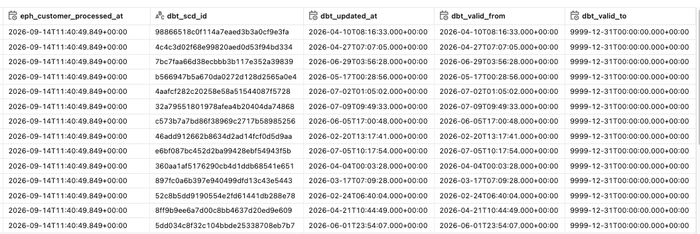

# Data Warehousing Project (Databricks + dbt)

This project demonstrates how to build a modern data warehouse on **Databricks (Unity Catalog)**, using **dbt** for transformation and (in progress) **Apache Airflow** for orchestration. It ingests a synthetic Walmart-style retail dataset from a serverless Postgres source into a Bronze/Silver/Gold-style lakehouse.

> **Status: In Progress.** Source generation, Bronze ingestion, and the Silver layer are implemented and working. Gold (star schema) and Airflow orchestration are not yet built — see [Project Status](#project-status) and [Roadmap](#roadmap--next-steps) for exactly what's done vs. planned.

## Table of Contents

- [Project Overview](#project-overview)
- [Project Status](#project-status)
- [Project Requirements](#project-requirements)
- [Data Architecture](#data-architecture)
- [Technology Stack](#technology-stack)
- [Getting Started](#getting-started)
- [Data Loading Pipeline](#data-loading-pipeline)
- [Data Quality Checks](#data-quality-checks)
- [Data Sources](#data-sources)
- [Documentation](#documentation)
- [Troubleshooting](#troubleshooting)
- [Roadmap / Next Steps](#roadmap--next-steps)

---

## Project Overview

This project involves:

- **Data Architecture**: A Bronze → Silver (technical) → Silver (business) pipeline on Databricks Unity Catalog, with a Gold star schema planned as the final layer.
- **Ingestion**: Incremental, timestamp-based capture from a Postgres OLTP source into Databricks via a managed Lakeflow connection.
- **Transformation**: dbt models on Databricks SQL, using incremental materializations and a denormalized One Big Table (OBT) for business-layer reporting.
- **Data Quality**: dbt generic and custom tests, applied incrementally as each model matures.
- **Orchestration** *(planned)*: Apache Airflow to schedule and monitor the ingestion → dbt run → dbt test pipeline end-to-end.

---

## Project Status

| Layer / Component | Status | Notes |
| --- | --- | --- |
| Source data generation (`load_data.py`, `init_database.sql`) | ✅ Done | Seeds 6 tables into Neon Postgres |
| Bronze ingestion (Databricks Lakeflow) | ✅ Done | Query-based incremental capture, scheduled |
| Silver_t (technical/per-source models) | ✅ Done | 6/6 tables modeled, incremental |
| Silver_b (business OBT) | ✅ Done | Single denormalized fact-style table |
| dbt tests | 🟡 Partial | Only `products_t` and `orders_t` covered (2/6); one custom OBT null-key test |
| Gold layer (star schema) | ⬜ Not started | Currently stops at the Silver_b OBT |
| Airflow orchestration | ⬜ Not started | Ingestion and dbt runs are still triggered manually |
| Architecture / ERD diagrams | ⬜ Not started | See [Documentation](#documentation) for exactly what to add |

---

## Project Requirements

### Building the Data Warehouse (Data Engineering)

#### Objective

Build a Databricks-based data warehouse that ingests retail transaction data from an OLTP source and prepares it for analytical reporting, using incremental (not full-reload) loading throughout.

##### Business Rules

- Each source table carries `created_timestamp`, `updated_timestamp`, and `is_active` audit columns; `updated_timestamp` is the cursor column for incremental capture.
- Records are upserted (not appended) on their natural key (`customer_id`, `order_id`, `product_id`, etc.) so re-running ingestion or dbt does not create duplicates.
- The Silver_b OBT should never contain a row with a null foreign key across the six join keys (`order_id`, `order_item_id`, `customer_id`, `product_id`, `employee_id`, `store_id`) — enforced by a custom dbt test (currently `warn` severity, see [Data Quality Checks](#data-quality-checks)).

#### Specifications

- **Data Source**: A single OLTP-style source (Postgres, hosted on Neon) with six related tables: `customers`, `stores`, `products`, `employees`, `orders`, `order_items`.
- **Loading Strategy**: Incremental only — native CDC is unavailable on Databricks' free tier, so ingestion uses query-based incremental capture on `updated_timestamp` instead.
- **Integration**: All six tables are joined into a single wide business table (OBT) as an interim analytics-ready layer, with a proper dimensional (star schema) model planned as the next step.
- **Documentation**: Clear source-to-target mapping and setup steps so the pipeline can be reproduced from scratch (see [Getting Started](#getting-started)).

---

## Data Architecture

The project follows a Bronze → Silver → (planned) Gold pattern, adapted for Databricks Unity Catalog:

- **Bronze Layer**: Raw data landed from the Postgres source into the `walmart.bronze` schema via Databricks Lakeflow, no transformation applied.
- **Silver_t (Technical) Layer**: One incremental dbt model per source table (`customers_t`, `stores_t`, `products_t`, `employees_t`, `orders_t`, `order_items_t`), each keyed on its natural ID and watermarked on `updated_timestamp`, with a `processed_at` audit column added.
- **Silver_b (Business) Layer**: A single denormalized One Big Table (`obt_b`) that left-joins all six Silver_t models around `orders`, renaming columns per source table (e.g. `customer_first_name`, `store_city`) so downstream consumers don't need to know the join logic.
- **Gold Layer** *(planned)*: A dimensional star schema (fact_orders + dimension tables for customers, products, stores, employees) built on top of Silver_b, for BI-tool consumption.

> **📌 Image placeholder — Architecture Diagram**: Add a diagram here (e.g. `assets/docs/data_architecture_diagram.png`) showing Postgres → Databricks Bronze → Silver_t → Silver_b → Gold, mirroring the one in the `warehouse-project-local` repo. This doesn't exist yet — worth creating once Gold is built so the diagram reflects the final architecture in one pass.

#### Technology Stack

- **Source Database**: Lakebase Postgres (via [Neon](https://neon.tech))
- **Lakehouse Platform**: Databricks (Unity Catalog, Lakeflow ingestion, SQL Warehouse)
- **Transformation**: dbt Core with the `dbt-databricks` adapter
- **Orchestration** *(planned)*: Apache Airflow
- **Package/Environment Management**: `uv` (Python), Node/npm (for Neon CLI tooling)
- **IDE**: VS Code, with the "Power User for dbt" extension

---

## Getting Started

### Prerequisites

- A [Neon](https://neon.tech) account (serverless Postgres)
- A Databricks workspace with Unity Catalog enabled
- Python 3 with `uv` installed
- Node.js (for the Neon CLI)

### Setup Steps

1. **Provision the Postgres source (Neon)**

   ```bash
   npm i -g neon@latest && neon login
   neon skills -y
   neon mcp -y
   neon link --project-id <your-project-id> --branch production -y
   neon config init
   neon deploy
   ```

2. **Create the source schema and seed data**

   ```bash
   # Creates the 6 source tables
   psql "$DATABASE_URL" -f src/warehouse_airflow_dbt/init_database.sql

   # Loads CSV seed data into each table (fails if tables aren't empty)
   uv run src/warehouse_airflow_dbt/load_data.py --data-dir <path-to-csvs>
   ```

3. **Create the Unity Catalog structure in Databricks**

   Create a standard catalog named `walmart` and grant access to all workspaces.

   > **📌 Image**: `assets/docs/databricks_catalog_step1.png` — catalog creation screen.
   > **📌 Image**: `assets/docs/databricks_catalog_step2.png` — save without creating keys.

   Then create the `bronze` schema inside it.

   > **📌 Image**: `assets/docs/databricks_create_schema.png` — schema creation screen.

4. **Connect Databricks to the Postgres source**

   Confirm the database is reachable:

   ```bash
   neon psql --database-name <your_database_name>
   ```

   In Databricks, go to **Data Ingestion → Postgres connection**, and authenticate with username/password using the connection string generated at project creation:

   ```
   postgresql://<username>:<password>@<host>/neondb?channel_binding=require&sslmode=require
   ```

   > **📌 Image**: `assets/docs/databricks_data_sources.png` — selecting the source database/tables.
   > **📌 Image**: `assets/docs/image-2.png` *(rename to something descriptive, e.g. `databricks_cursor_column.png`)* — setting `update_timestamp` as the cursor column.
   > **📌 Image**: `assets/docs/image.png` *(rename, e.g. `databricks_ingestion_schedule.png`)* — selecting the `bronze` schema destination, schedule, and failure alert recipients.

   Native Change Data Capture is **not available on Databricks' free tier**, so this pipeline uses **query-based incremental capture** instead — Databricks runs a managed query on a schedule, using `updated_timestamp` to identify new/changed rows.

5. **Set up dbt**

   ```bash
   uv add dbt-core dbt-databricks
   cd dbt && dbt init
   ```

   When prompted, provide:
   - **Host** and **HTTP path**: from your Databricks SQL Warehouse's *Connection details* tab.
   - **Access token**: generate one under your Databricks profile → *Developer options* (scope: `sql`), and save it immediately.
   - **Catalog**: `walmart` (must have Unity Catalog enabled).
   - **Schema**: a name of your choice; **threads**: `1` is sufficient for this project's volume.

   If `dbt debug` fails, check `~/.dbt/profiles.yml` for misconfigured values.

6. **Run and test the models**

   ```bash
   dbt run   # builds silver_t and silver_b models
   dbt test  # runs the generic + custom tests defined so far
   ```

   > **📌 Image**: `assets/docs/silver_technical_creation.png` — currently sitting in the repo root; move it into `assets/docs/` for consistency with the other screenshots, and reference it here to show the Silver_t tables after a successful `dbt run`.

---

## Data Loading Pipeline

### Bronze Layer (Raw Ingestion)

- **Purpose**: Land raw source data in Databricks without transformation.
- **Process**: Databricks Lakeflow connects to the Neon Postgres source and performs query-based incremental capture on a schedule, landing rows into `walmart.bronze`.
- **Cursor column**: `updated_timestamp` on every source table.

### Silver_t Layer (Per-Source Transformation)

- **Purpose**: One clean, incrementally-updated table per source entity.
- **Process**: Each dbt model (`customers_t`, `stores_t`, `products_t`, `employees_t`, `orders_t`, `order_items_t`) is materialized as `incremental`, keyed on its natural ID, and only processes rows where `updated_timestamp` is newer than the current max in the target table — avoiding a full table rescan on every run.
- **Files**: `dbt/warehouse/models/silver_t/*.sql`, schema/tests in `properties.yml`.

### Silver_b Layer (Business OBT)

- **Purpose**: A single wide, denormalized table (`obt_b`) for straightforward analytical querying without needing to know the underlying join logic.
- **Process**: Left-joins all six Silver_t models around `orders_t`, renaming ambiguous columns per source (e.g. `customer_first_name` vs. `employee_first_name`).
- **Files**: `dbt/warehouse/models/silver_b/obt_b.sql`.

### Gold Layer *(planned)*

- **Purpose**: A dimensional star schema for BI-tool consumption, separating `fact_orders` from `dimension_customers`, `dimension_products`, `dimension_stores`, and `dimension_employees`.
- **Status**: Not yet started — Silver_b currently serves as the analytics-ready layer in the interim.

---

## Data Quality Checks

Testing is applied via dbt's built-in test framework:

- **`products_t`**: `not_null` and `unique` on `product_id`; `not_null` and `greater_than: 0` on `price`.
- **`orders_t`**: `not_null` and `unique` on `order_id` (with `warn_if: >10` / `error_if: >1000` duplicate thresholds).
- **`obt_b` (custom test)**: fails (currently `warn` severity) if any row has a null `order_id`, `order_item_id`, `customer_id`, `product_id`, `employee_id`, or `store_id` — i.e., a broken join.

**Known gap**: `customers_t`, `stores_t`, `employees_t`, and `order_items_t` have no tests yet. See [Roadmap](#roadmap--next-steps).

---

## Data Sources

### Postgres Source System (via Neon)

- **customers**: customer_id, name, contact info, location, audit columns
- **stores**: store_id, store_name, location, audit columns
- **products**: product_id, product_name, category, brand, price, audit columns
- **employees**: employee_id, store_id (FK), name, job_title, salary, audit columns
- **orders**: order_id, customer_id (FK), store_id (FK), order_timestamp, payment_method, order_status, total_amount, audit columns
- **order_items**: order_item_id, order_id (FK), product_id (FK), quantity, unit_price, line_amount, audit columns

Seed data is loaded via `src/warehouse_airflow_dbt/load_data.py`, which refuses to run if any target table already has rows (idempotency guard for the seeding step itself).

---

## Documentation

### Existing Diagrams / Screenshots (`assets/docs/`)

- `databricks_catalog_step1.png`, `databricks_catalog_step2.png` — Unity Catalog creation
- `databricks_create_schema.png` — Bronze schema creation
- `databricks_data_sources.png` — Postgres connection setup
- `databricks_ingestion.png`, `image.png`, `image-2.png` — ingestion configuration *(worth renaming `image.png`/`image-2.png` to something descriptive)*

### 📌 Diagrams still to create

| Diagram | Suggested path | When to add it |
| --- | --- | --- |
| End-to-end architecture diagram (Postgres → Bronze → Silver_t → Silver_b → Gold) | `assets/docs/data_architecture_diagram.png` | Now, or once Gold exists |
| Star schema / data model diagram | `assets/docs/gold_data_model_diagram.png` | Once the Gold layer is built |
| Airflow DAG graph screenshot | `assets/docs/airflow_dag_graph.png` | Once orchestration is implemented |
| Data flow diagram per layer (optional, matches base project style) | `assets/docs/{layer}_dataflow_diagram.png` | Optional polish pass |

Move `silver_technical_creation.png` from the repo root into `assets/docs/` to keep all documentation images in one place, consistent with the `warehouse-project-local` project.

---

## Troubleshooting

### dbt profile path issues

If dbt can't find or apply your connection profile:

```bash
mv ~/.dbt/profiles.yml ~/<repository_path>/dbt/profiles.yml
```

Then re-run `dbt debug` to confirm the connection.

### Database connection failures

- Run `cat ~/.dbt/profiles.yml` and check host, HTTP path, and token are correct.
- Confirm the Neon database is reachable with `neon psql --database-name <your_database_name>` before troubleshooting the Databricks side.

---

## Roadmap / Next Steps

1. Add dbt tests to the remaining four Silver_t models (`customers_t`, `stores_t`, `employees_t`, `order_items_t`).
2. Design and build the Gold-layer star schema (fact_orders + dimension tables) on top of `obt_b`.
3. Implement Apache Airflow DAGs to orchestrate ingestion trigger → `dbt run` → `dbt test`, replacing the current manual trigger.
4. Add the architecture, data model, and DAG diagrams listed in [Documentation](#documentation).
5. Promote the custom OBT null-key test from `warn` to `error` severity once confident the join logic is stable.

`dbt snapshot`



gold layer
`dbt run`

